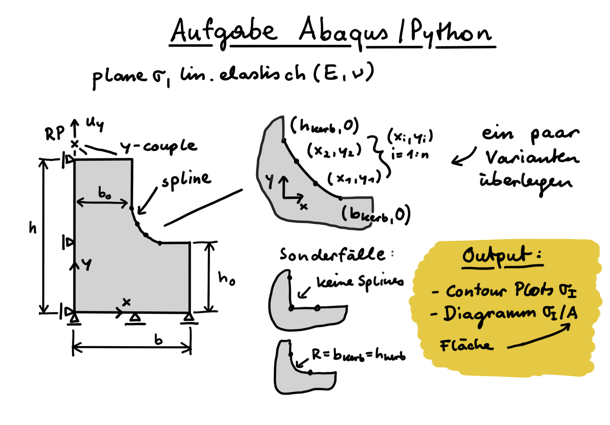

# lv_abq_python_2021
Skripte aus der Abaqus/Python [Übung](https://online.unileoben.ac.at/mu_online/wbLv.wbShowLVDetail?pStpSpNr=3210324) im Wintersemester 2021/22.

Die Skripte vom Modellaufbau der ersten vier Einheiten sind hier ergänzt, um das Modell der Lochplatte aufzubauen: `modellaufbau_komplett.py`

Das online Skriptum dazu ist auf [martinpletz.com/fe-scripting](https://www.martinpletz.com/fe-scripting) zu finden.

### Aufgabe 1, 2021-11-29
Zwei Wochen Zeit, um dieses Modell geskriptet aufzubauen. In der Einheit am 2021-12-06 können wir nochmal drüber reden.

